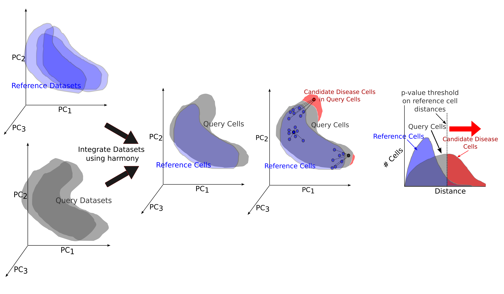

# scPSS: single-cell Pathological Shift Scoring

[](https://doi.org/10.1101/gr.280411.125)
[](https://www.python.org/)

A statistical framework for quantifying pathological progression in single-cell transcriptomics data by measuring shifts from healthy reference states.

The Documentation of scPSS code is available at [scPSS Documentation](https://scpss.readthedocs.io/en/latest/api.html) and a tutorial on how to use it on single-cell data is available at [Tutorial](https://scpss.readthedocs.io/en/latest/scpss_on_mouse_infarcted_heart_sc.html).


## Overview



scPSS (single-cell Pathological Shift Scoring) is a computational method that:
- Quantifies how much individual cells deviate from healthy reference states
- Provides statistical measures for pathological shifts in diseased samples
- Enables condition prediction at both cellular and individual levels

## Installation

```bash
pip install git+https://github.com/SaminRK/scPSS.git
```

## Input Data Format

`scPSS` requires input in the [AnnData](https://anndata.readthedocs.io/en/latest/) format, which is standard in the Scanpy ecosystem.

### Metadata in `.obs`

- The `.obs` should contain a **categorical column** (e.g., `sample`) indicating the **sample ID** for each cell.
- This `sample` field is used for performing **sample-specific batch effect correction**. Also, we pass into scPSS the list of reference and query samples for defining **reference** vs. **query** groups (e.g., healthy vs. disease).


## Quickstart
```Python
import scanpy as sc
from scpss import scPSS

# Load your data
adata = sc.read("anndata.h5ad")

# Initialize scPSS with your data
scpss = scPSS(
    adata,
    sample_key="sample",              # Column name for sample IDs
    reference_samples=[
        "reference_sample_1",
        "reference_sample_2",
    ],                                # List of reference sample IDs
    query_samples=["query_sample_1", "query_sample_2"],
)                                     # List of query sample IDs

# Run the analysis
scpss.harmony_integrate()
scpss.find_optimal_parameters()
scpss.set_distance_and_condition()

# Access pathological scores
scores = scpss.ad.obs["scpss_scores"]
```

## Dependencies

The dependencies are listed in [requirements.txt](https://github.com/SaminRK/scPSS/blob/master/requirements.txt)

## Reproducibility

The code to reproduce the results in our paper is available at [scPSS-reproducibility](https://github.com/SaminRK/scPSS-reproducibility).


## Citation

If you use scPSS in your research, please cite:

```bibtex
@article{khan2026quantifying,
  title={Quantifying pathological progression from single-cell transcriptomic data with scPSS},
  author={Khan, Samin Rahman and Rahman, M Saifur and Rahman, M Sohel and Samee, Md Abul Hassan},
  journal={Genome Research},
  volume={36},
  number={2},
  pages={375--386},
  year={2026},
  publisher={Cold Spring Harbor Lab}
}
```